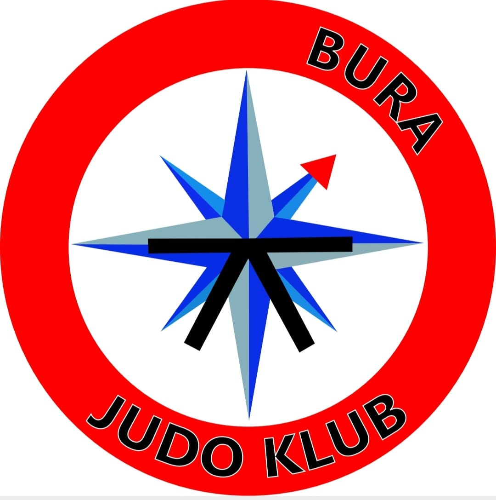
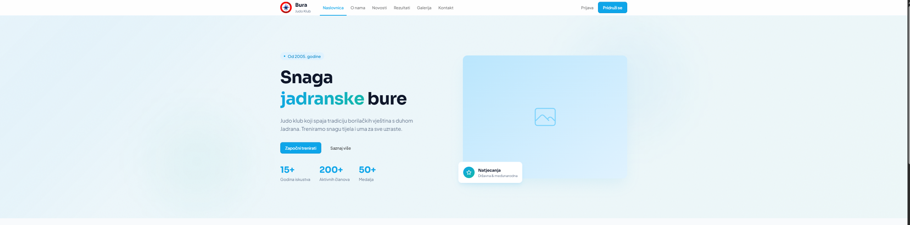
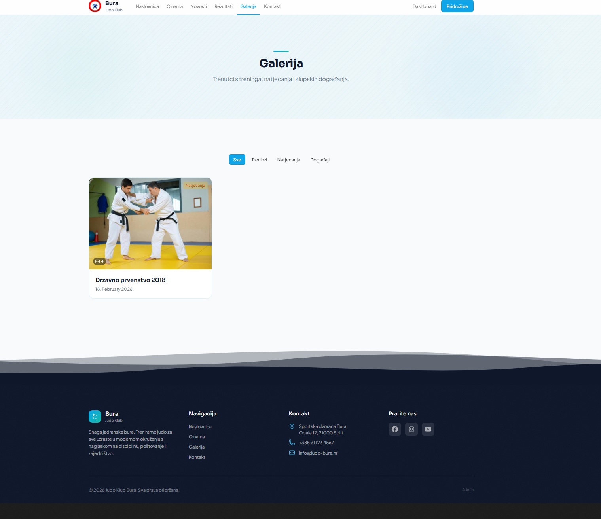
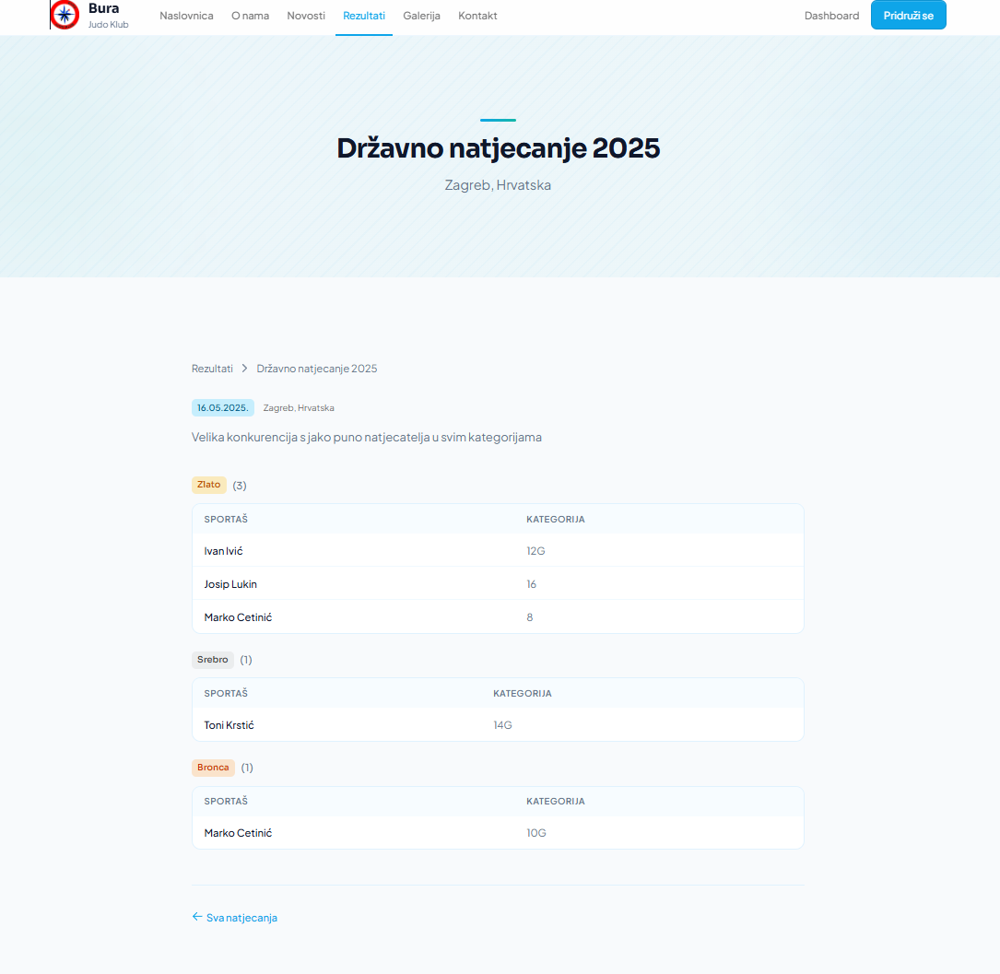
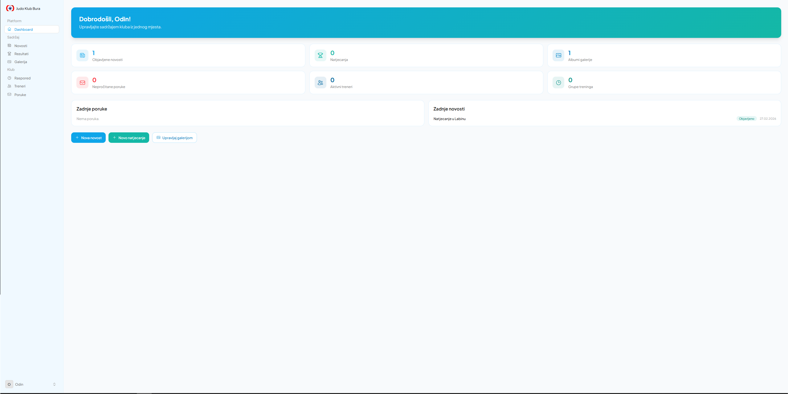
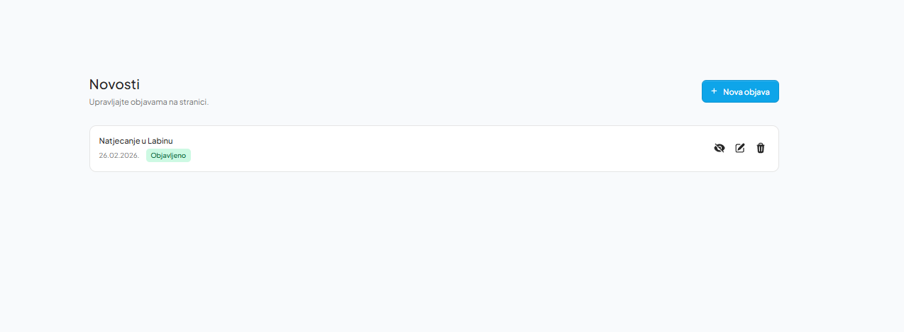
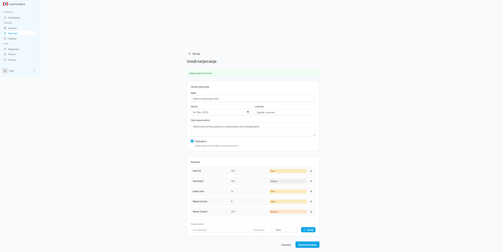
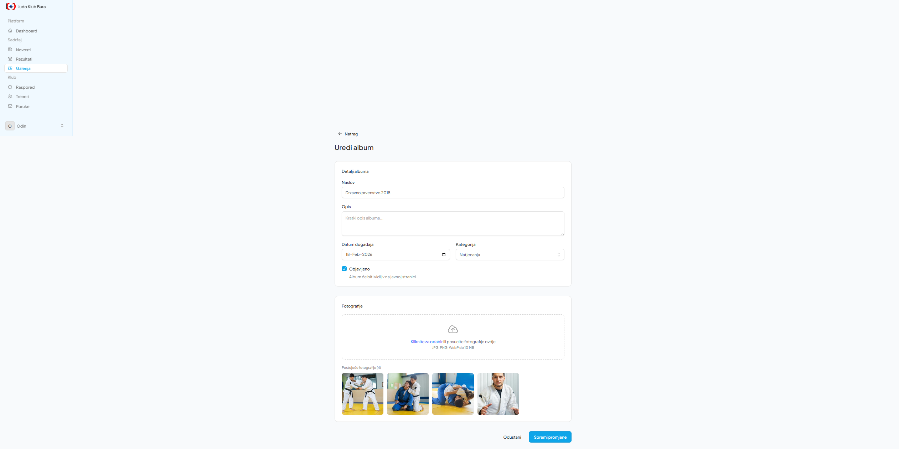

<p align="center">
  
</p>

<h1 align="center">Judo Klub Bura</h1>

<p align="center">
  <strong>Web application for Judo Club Bura — a club from the Croatian Adriatic coast, active since 2005.</strong><br>
  Built with Laravel 12, Livewire 4, Tailwind CSS, and Flux UI.
</p>

<p align="center">
  
  
  
  
</p>

---

## Overview

Judo Klub Bura is a full-featured club management web application that provides a **public-facing website** for visitors and a **secure admin dashboard** for content management. The entire UI is in Croatian.

The design uses a custom "Bura" (Adriatic wind) theme with blue-teal gradients, wind-streak animations, and a clean, modern aesthetic.

---

## Public Website

### Hero & Landing Page

The homepage features an animated hero section with the club motto *"Snaga jadranske bure"* (Strength of the Adriatic wind), key stats, and calls to action.



### Gallery

Public gallery page with category filtering (Trainings, Competitions, Events). Each album opens into a full image grid with a lightbox viewer.



### Competition Results

Detailed competition results pages showing athlete placements organized by medal type (Gold, Silver, Bronze) with weight categories.



---

## Admin Dashboard

The admin panel is accessible at `/dashboard` and provides a complete CMS for managing all club content.

### Dashboard Overview

A welcome screen with quick stats (published posts, competitions, gallery albums, unread messages, active coaches, training groups) and recent activity.



### News Management (Novosti)

Create, edit, publish/unpublish, and delete news posts. Posts support titles, rich content, excerpts, and scheduled publishing dates. Slugs are auto-generated.



### Competition Management (Rezultati)

Manage competitions with inline athlete results. Each competition has a name, date, location, and description. Results track athlete name, weight category, and placement (Gold/Silver/Bronze/5th/7th/Participation).



### Gallery Management (Galerija)

Create and manage photo albums with drag-and-drop image uploads. Images are automatically optimized and thumbnails are generated. Albums support categories, event dates, cover image selection, and publish toggling.



### Training Schedule (Raspored)

Manage training groups and their session times. Each group has a name, age range, icon, and color. Sessions can be added per group with day-of-week and time ranges. Groups can be reordered and toggled active/inactive.


### Additional Admin Features

- **Coach Management (Treneri)** — Add/edit coaches with photo uploads, belt rank, bio, and custom sort order
- **Contact Messages (Poruke)** — Inbox for contact form submissions with read/unread status and email notifications

---

## Features

### Public Pages
- Home page with animated hero, feature cards, training schedule, and latest news
- About page with club history
- Gallery with category filtering and lightbox image viewer
- News listing and detail pages
- Competition results with medal-grouped athlete tables
- Contact form with validation and email notifications

### Admin Dashboard
- Content management for news, competitions, galleries, coaches, and training schedule
- Image upload with automatic optimization and thumbnail generation
- Publish/unpublish toggle for all content types
- Contact message inbox with read/unread tracking
- Responsive sidebar navigation with unread message badges

### Technical
- **Authentication** with Laravel Fortify (login, register, password reset, two-factor authentication)
- **Livewire 4** reactive components for all admin forms and public interactive elements
- **Flux UI** component library for consistent admin interface
- **Intervention Image** for server-side image processing
- **Auto-generated slugs** with collision detection
- **Email notifications** when contact form is submitted
- **Wind-blow animation** on hero heading using Alpine.js + CSS keyframes

---

## Tech Stack

| Layer       | Technology                        |
|-------------|-----------------------------------|
| Framework   | Laravel 12                        |
| Frontend    | Livewire 4, Alpine.js, Blade     |
| Styling     | Tailwind CSS 4, Flux UI          |
| Auth        | Laravel Fortify (with 2FA)        |
| Images      | Intervention Image 3.11           |
| Database    | SQLite (default) / MySQL / Postgres |
| PHP         | 8.2+                              |

---

## Installation

```bash
# Clone the repository
git clone https://github.com/OdinZD/judo-klub-bura.git
cd judo-klub-bura

# Install dependencies
composer install
npm install

# Environment setup
cp .env.example .env
php artisan key:generate

# Database
php artisan migrate

# Build frontend assets
npm run build

# Start the development server
php artisan serve
```

The application will be available at `http://localhost:8000`.

---

## Project Structure

```
app/
├── Enums/              # DayOfWeek, GalleryCategory, PlacementType
├── Livewire/
│   ├── Admin/          # Dashboard components (9 components)
│   ├── ContactForm     # Public contact form
│   ├── GalleryAlbums   # Public gallery listing
│   └── AlbumImageGrid  # Public album image grid
├── Mail/               # ContactReceived mailable
├── Models/             # 10 Eloquent models
└── Services/           # ImageService (image processing)

resources/
├── css/app.css         # Tailwind config, custom animations
├── js/app.js           # Alpine.js components
└── views/
    ├── components/     # Reusable Blade components
    ├── layouts/        # App, auth, and public layouts
    ├── livewire/       # Livewire component views
    └── pages/          # Public and settings pages
```

---

## License

This project is proprietary software for Judo Klub Bura.
